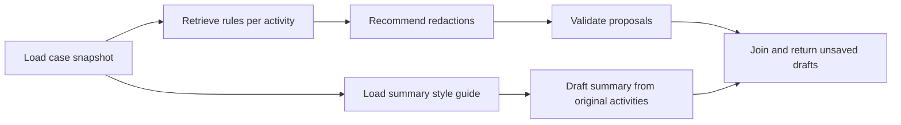

# Case analysis drafts

Optional [Studio and LangSmith tracing](LANGGRAPH_STUDIO.md) is now available.
Studio adds development-server run storage; the application workflow below still
uses a request-scoped graph with no persisted approval state.

On `main` with PostgreSQL, **Analyze case** produces unsaved redaction proposals
and an editable summary. The existing Hugging Face/Qwen provider is unchanged.
Opening a case or its list only reads saved data. Previously saved summaries
remain visible until a reviewer explicitly approves a replacement.



`backend/app/case_analysis.py` creates a typed, request-scoped StateGraph.
The case is read once into immutable activity snapshots; PostgreSQL uses a
repeatable-read transaction for that load. Each database-reading node owns and
closes its own session. Sessions and ORM objects never enter graph state.
The two branches write separate state keys, and an explicit multi-node join
waits for both. Activities within the redaction branch are processed sequentially.
No interrupt, checkpointer, thread ID, background job, or persisted graph state
is used. LangGraph is the only new direct production dependency; its transitive
checkpoint package is installed but no checkpoint functionality is configured.

The redaction branch reuses mandatory policy retrieval, example exclusion,
grounding, exact-substring/offset normalization, allowed types, and duplicate
validation. The same helpers serve the existing per-activity endpoint.
Acceptance still revalidates the current activity, policy evidence, and saved
redactions. The summary branch reads the indexed corpus's section 4 style guide
and only original activity identifiers, types, and descriptions. It never reads
generated proposals or saved redactions as summary input. The prompt requires
factual customer-facing language without internal caps, counsel instructions,
or unsupported conclusions; a human must still check that the model obeyed it.

## API and review

`POST /cases/{case_id}/analyze` returns 200 with unsaved drafts grouped by activity.
For example, this synthetic response has no proposed redactions:

```json
{
  "case_id": 2,
  "activities": [{"activity_id": 3, "recommendations": []}],
  "summary_draft": "The customer asked for an update on the delivery."
}
```

Nonempty recommendations have the same fields and supporting policy evidence as
the [grounded recommendation response](GROUNDED_AI_SETUP.md). Generation never
inserts redactions or updates the case. Empty cases return `activities: []` and
`summary_draft: null` without retrieval or model calls. Unknown cases return 404;
closed cases return 409. Retrieval or guidance failures return 503, and model
failures return 502. A failed branch produces no partial response or saved data.
Analysis is limited to 20 activities, 48,000 total description characters, and
12,000 characters per activity (422 if exceeded). Provider requests have a
60-second timeout each; a whole case can take longer because activity calls are
sequential. Summaries are limited to 4,000 characters.

`POST /cases/{case_id}/summary/approve` saves only the reviewed summary:

```json
{
  "summary": "The customer asked for an update on the delivery.",
  "expected_summary": null
}
```

Supply the current saved summary as `expected_summary`, or null if absent.
The endpoint locks the case row and returns 409 if that saved value has changed
or the case is closed, 404 if missing, and 422 for blank/oversized text. Success
returns the updated case. This prevents silently overwriting a concurrent
summary approval. It does not guarantee the underlying activities stayed
unchanged while the reviewer edited; reviewers should reload and reanalyze when
notes change. The legacy `POST /cases/{case_id}/ai-summary` now returns 410 and
does not generate or save anything.

In React, edit then **Approve summary**, or **Discard summary draft**. Redaction
**Accept/Reject** controls remain independent. Approving or discarding the summary
leaves pending redactions intact, and accepting a redaction leaves the summary
draft intact. Manual create/delete in the UI and manual updates via the API still work. Drafts
live only in browser memory and are lost on navigation, refresh, or reanalysis.

## Run and verify

Use the existing PostgreSQL environment and provider credentials; never commit
local environment files. No schema migration was added. For a fresh setup,
follow the README database setup and ingest the corpus before analysis:

```bash
cd backend
uv sync --locked --extra dev
uv run --env-file .env.postgres alembic upgrade head
uv run --env-file .env.postgres python -m app.ingest_references
uv run --env-file .env.postgres uvicorn app.main:app --reload
```

Start `npm run dev` in `frontend/`, open an active seeded case, select **Analyze
case**, and verify both draft types. Review a summary separately from each
redaction. Existing development data need not be reseeded.

For the current backend/frontend checks and database-mode limits, see
[README verification](../README.md#verification). Tests cover snapshot consistency,
parallel branches, session ownership, no generation writes, failure handling,
independent approvals, and conflicting summary changes. Tests use fake models.

The live Studio verification is documented in [Studio setup](LANGGRAPH_STUDIO.md).
Model instructions and structural validation cannot prove factual accuracy or
detect every sensitive disclosure; review remains mandatory. Authentication is
outside the current learning application.
